# Music Stats

> I need to come up with a more creative name, probably.

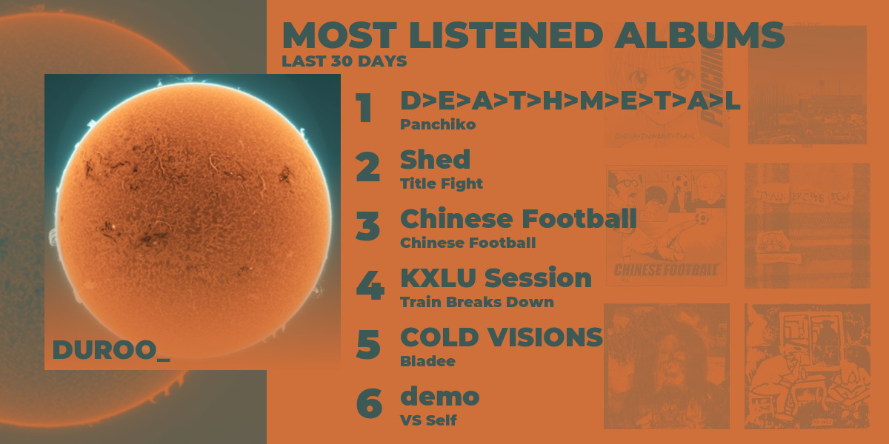

A little terminal app that displays your top albums over some time period (thanks to [Last.fm](https://www.last.fm/) for their API).

Made with [Rust](https://www.rust-lang.org/) (it's blazingly fast, btw).

## Motivation

Originally, this project was made in [Gleam](https://gleam.run/) as a way to learn the language. However, I thought my code was hilariously bad and decided to rewrite it.

Also, I wanted to learn how to use [ImageMagick](https://imagemagick.org/index.php), so I used it to generate the album art and to get common colors from pictures.

## Prerequisites

- [Rust](https://www.rust-lang.org/) (obviously)
- [ImageMagick](https://imagemagick.org/index.php) (for album art)
- [Last.fm API key](https://www.last.fm/api/account/create) (to fetch data)

## Installation

Pretty much the same as any Rust project:

```sh
git clone https://github.com/durocodes/music-stats
cd music-stats
cargo run
```

## Showcase

|              Midnight              |                Forest                |              Ocean               |              Strawberry              |
| :--------------------------------: | :----------------------------------: | :------------------------------: | :----------------------------------: |
|  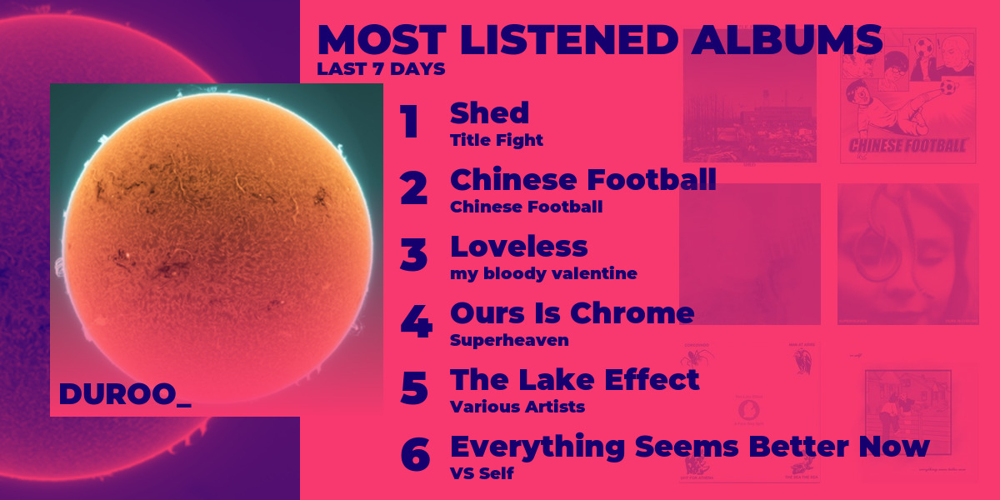  |     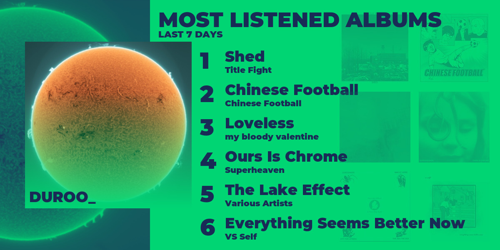     |    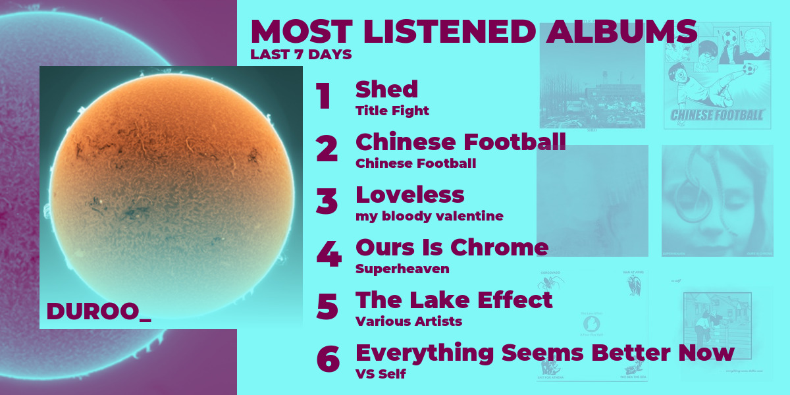    | 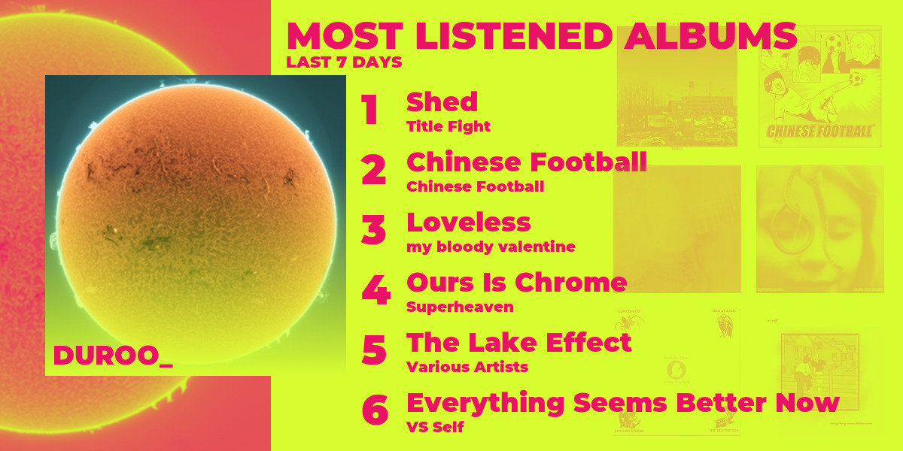 |
|             Bumblebee              |               Crimson                |               Aqua               |               Lavender               |
| 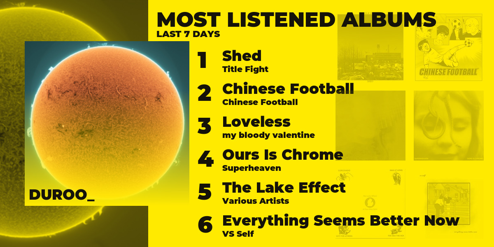 |    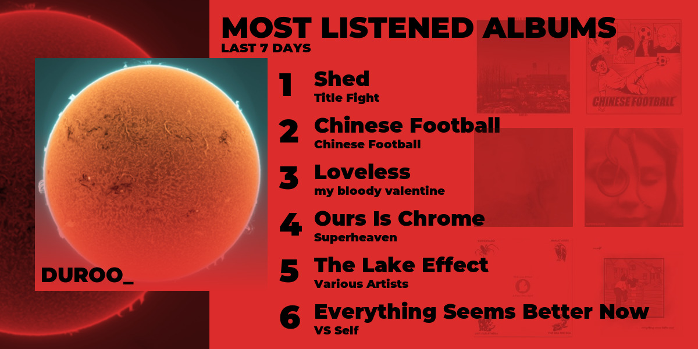    |     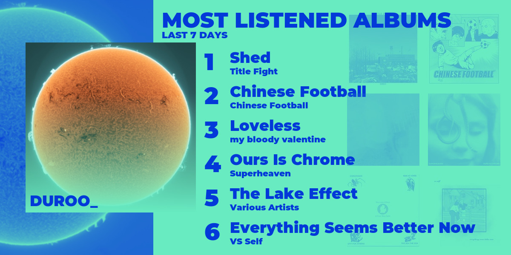     |   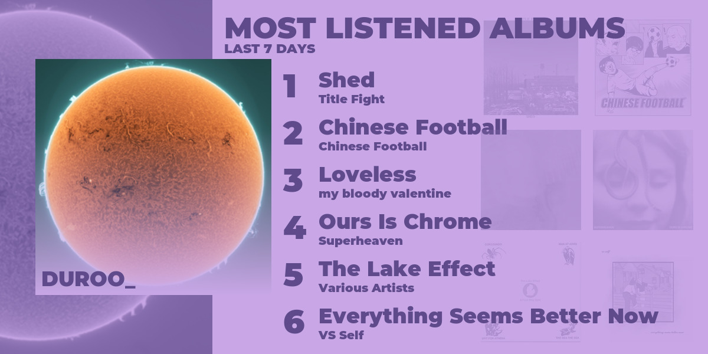   |
|              Emerald               |                Cherry                |             Twilight             |                Flame                 |
|   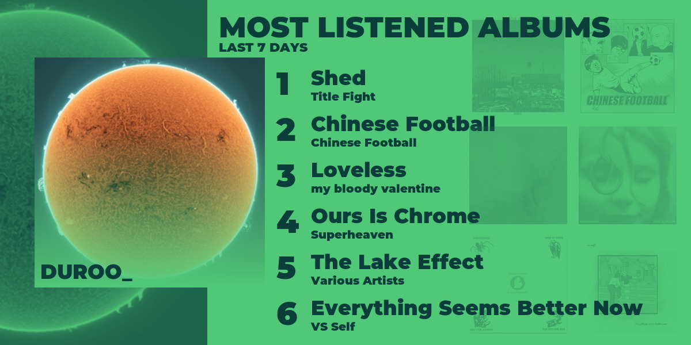   |     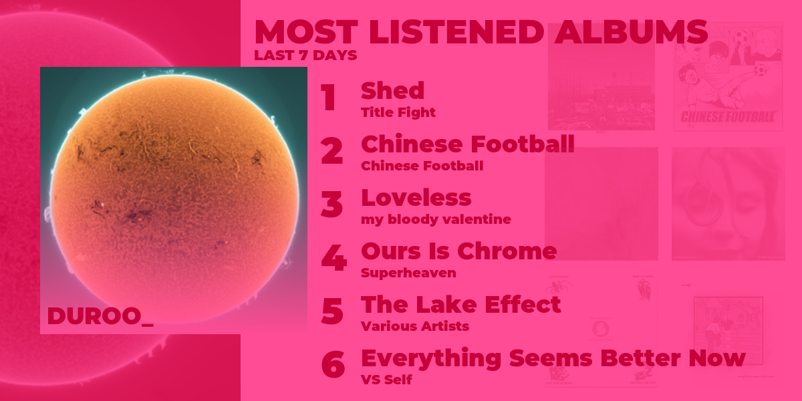     | 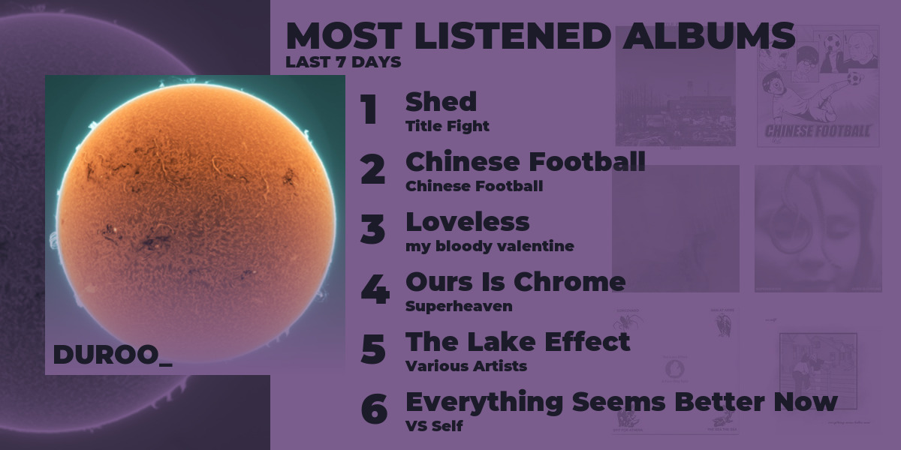 |      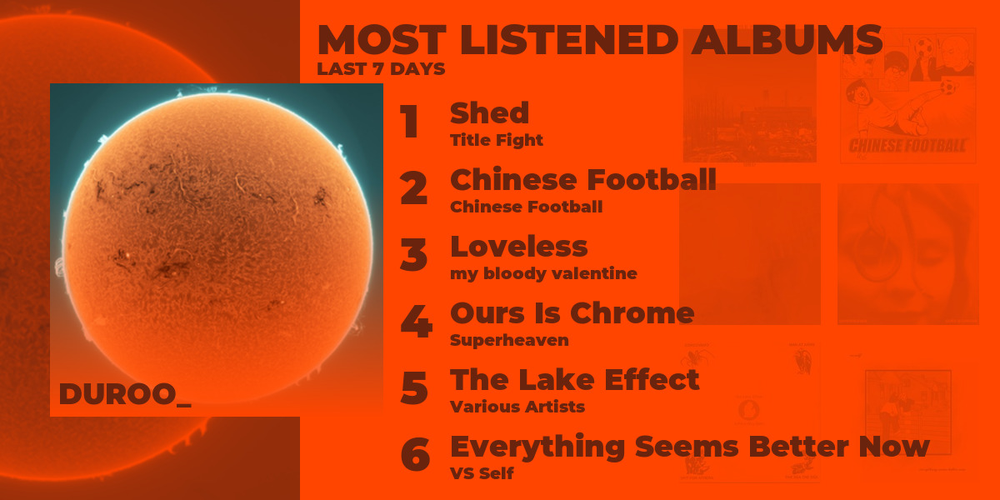      |
|                Moss                |              Catppuccin              |             Horizon              |                Auto\*                |
|      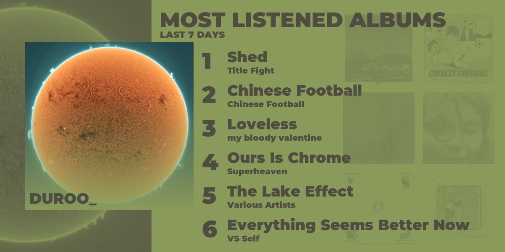      | 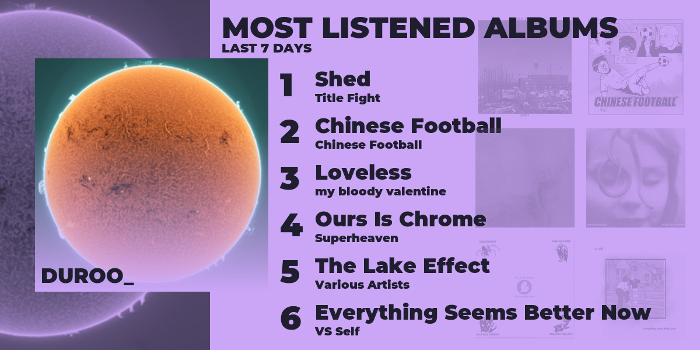 |  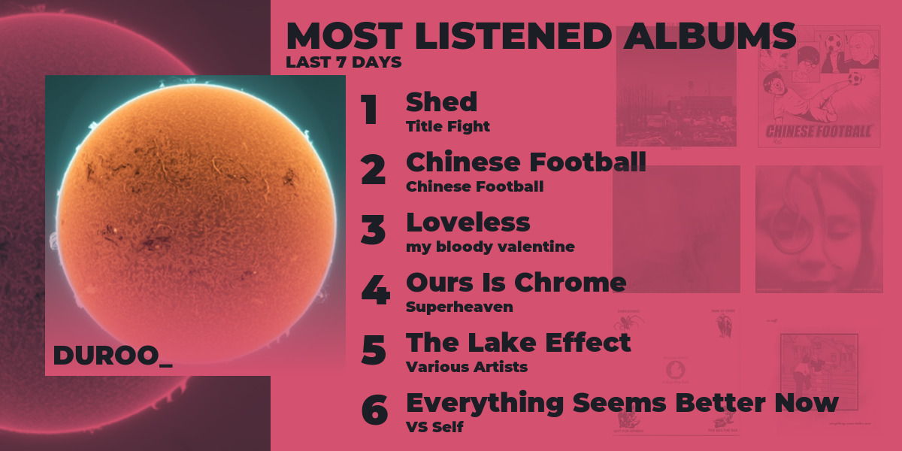  |              |

> [!NOTE]
> \*Auto theme will look different for others, since it's based on profile picture.
